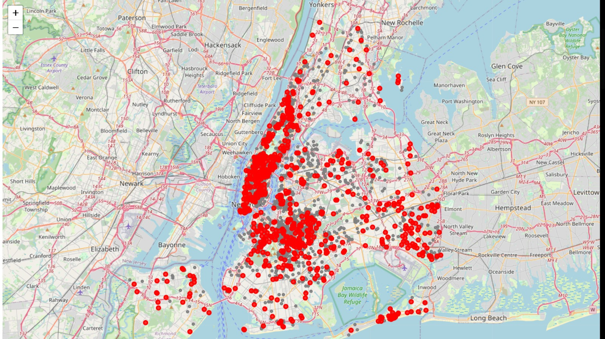

# NYC Airbnb Multivariate Analysis  
**PCA • Outlier Detection • Random Forest Classification**

This project performs an end-to-end multivariate analysis of **NYC Airbnb listings** to understand pricing patterns, identify unusual listings, and classify properties into **budget, mid-range, and luxury** categories using statistical analysis and machine learning techniques.

---

## Project Overview
The NYC Airbnb market contains complex relationships between location, property features, host characteristics, and price.  
This project explores those relationships through:

- Exploratory Data Analysis (EDA)
- Dimensionality reduction using **Principal Component Analysis (PCA)**
- **Outlier detection** using multiple techniques
- **Random Forest classification** for price category prediction
- Geographic visualization using **Folium**

---

## Dataset
- **Source:** Inside Airbnb (NYC Listings)
- **Link:**  
  http://data.insideairbnb.com/united-states/ny/new-york-city/2024-09-01/data/listings.csv.gz

> The dataset is downloaded automatically in the notebook.  
> It is **not stored in this repository** to keep the project lightweight.

---

## What This Project Covers

### 1. Data Preparation & EDA
- Data cleaning and missing value handling
- Distribution analysis of price, reviews, and property features
- Correlation analysis of numerical variables
- Price trends across neighborhoods and room types

### 2. Geographic Analysis
- Interactive NYC map using **Folium**
- Visualization of listing density and price variation by location

### 3. Principal Component Analysis (PCA)
- Feature standardization
- Scree plot and cumulative variance analysis
- Interpretation of principal components using loadings
- Visualization of listings in reduced PCA space

### 4. Outlier Detection
Multiple anomaly detection methods were applied and compared:
- **Isolation Forest**
- **Local Outlier Factor (LOF)**
- **PCA reconstruction error**

Outliers were analyzed geographically and by feature patterns to understand:
- Price anomalies
- Unusual feature combinations
- Location-based irregularities

### 5. Price Category Classification
- Created price categories: **Budget / Mid-range / Luxury**
- Trained **Random Forest classifiers**:
  - Using original features
  - Using PCA-reduced features
  - With and without outlier removal
- Evaluated using:
  - Confusion matrix
  - Classification report
  - Feature importance analysis


## Key Visualizations
The repository includes multiple visual outputs in the `assets/` folder:

### NYC Airbnb Price Distribution


### Feature Correlation


### PCA Explained Variance


### Model Insights


## How to Run the Project

1. Clone the repository
2. Install dependencies:
   ```bash
   pip install -r requirements.txt

## Tech Stack & Skills
- **Language:** Python
- **Libraries:** Pandas, NumPy, Matplotlib, Seaborn, Scikit-learn, Folium
- **Concepts:**
  - Exploratory Data Analysis (EDA)
  - Principal Component Analysis (PCA)
  - Outlier Detection
  - Random Forest Classification
  - Feature Importance
  - Model Evaluation
  - Geospatial Visualization

---

## Key Takeaways
- PCA revealed meaningful latent structure in Airbnb pricing features
- Different outlier detection methods identify distinct types of anomalies
- Random Forest models achieved strong performance in price category classification

